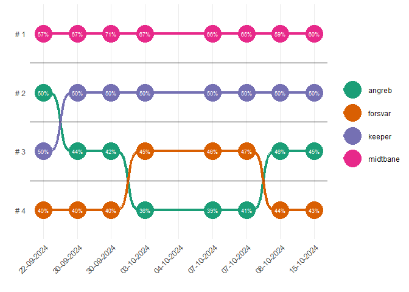
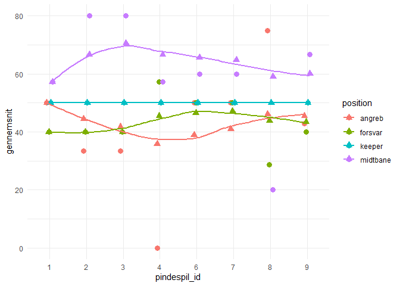
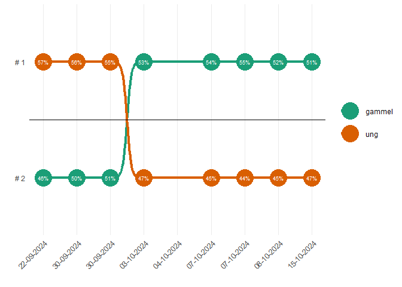
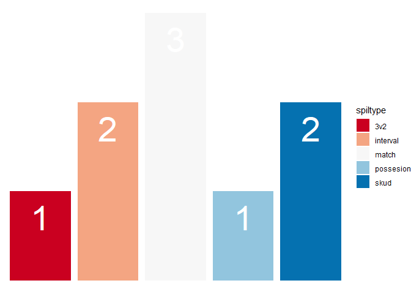
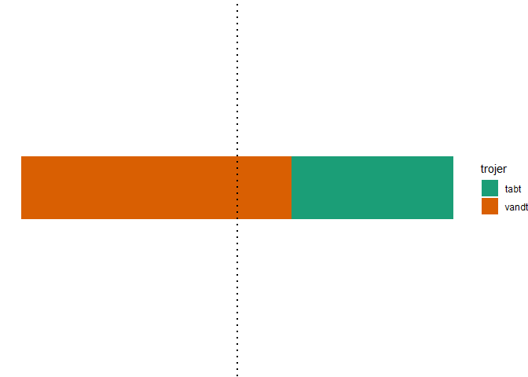

##### Sidst opdateret:

<table>
<thead>
<tr>
<th style="text-align:left;">
</th>
</tr>
</thead>
<tbody>
<tr>
<td style="text-align:left;">
2024-10-31
</td>
</tr>
</tbody>
</table>

# testS

#### Antal pindespil:

<table>
<thead>
<tr>
<th style="text-align:right;">
</th>
</tr>
</thead>
<tbody>
<tr>
<td style="text-align:right;">
9
</td>
</tr>
</tbody>
</table>

### Position

    test2 %>% 
       filter(!is.na(position)) %>% 
       group_by(pindespil_id, position, udfald) %>%
       summarise(vundne = n(), .groups = "drop") %>%
      rbind(data.frame(pindespil_id = c("8", "8"), 
                       position = c("keeper", "keeper"), 
                       udfald = c("tabende_hold", "vindende_hold"),
                       vundne = c(0,0))) %>%
       pivot_wider(names_from = udfald,
                   values_from = vundne, values_fill = list(vundne = 0)) %>% 
      mutate(gennemsnit = vindende_hold/(tabende_hold+vindende_hold)*100) %>% 
       ungroup() %>%
      group_by(position) %>% 
     mutate(gnm = cumsum(vindende_hold)/(cumsum(tabende_hold)+cumsum(vindende_hold))*100) %>% 
     ungroup() %>% 
      arrange(pindespil_id) %>%  
    ggplot(aes(x = pindespil_id, y = gennemsnit, color = position)) +
      geom_point(size = 3, position = position_dodge(width = 0.2)) +
      geom_point(aes(y = gnm, group = position), shape = 17, size = 3, na.rm = TRUE, position = position_dodge(width = 0.2)) +
      geom_smooth(aes(y = gnm, group = position, fill = position), method = "loess", se = F, na.rm = TRUE,
                  alpha = 0.2, position = position_dodge(width = 0.2)) +
      theme_minimal()

    ## `geom_smooth()` using formula = 'y ~ x'

    ## Warning: `position_dodge()` requires non-overlapping x intervals

    ## Warning: Removed 1 rows containing missing values (`geom_point()`).

### Alder

### Pindespilstype

### Trøjer

### Data

<table class="table table-striped">
<thead>
<tr>
<th style="text-align:left;">
pindespil\_id
</th>
<th style="text-align:left;">
dato
</th>
<th style="text-align:left;">
vindende\_hold
</th>
<th style="text-align:left;">
spiltype
</th>
<th style="text-align:left;">
trojer
</th>
<th style="text-align:left;">
joker
</th>
<th style="text-align:left;">
uafgjort
</th>
</tr>
</thead>
<tbody>
<tr>
<td style="text-align:left;">
1
</td>
<td style="text-align:left;">
22-09-2024
</td>
<td style="text-align:left;">
Banda , Biele , Bondo , Dalby , Lau , Nico , Noel , Trane , Mathias,
Nick
</td>
<td style="text-align:left;">
interval
</td>
<td style="text-align:left;">
vandt
</td>
<td style="text-align:left;">
</td>
<td style="text-align:left;">
</td>
</tr>
<tr>
<td style="text-align:left;">
2
</td>
<td style="text-align:left;">
30-09-2024
</td>
<td style="text-align:left;">
Aland , Biele , Bondo , Shimal , Kav , Mathias , Christian, Jokke
</td>
<td style="text-align:left;">
match
</td>
<td style="text-align:left;">
tabt
</td>
<td style="text-align:left;">
Christian
</td>
<td style="text-align:left;">
</td>
</tr>
<tr>
<td style="text-align:left;">
3
</td>
<td style="text-align:left;">
30-09-2024
</td>
<td style="text-align:left;">
Aland , Biele , Bondo , Shimal , Kav , Mathias , Christian, Jokke
</td>
<td style="text-align:left;">
skud
</td>
<td style="text-align:left;">
tabt
</td>
<td style="text-align:left;">
</td>
<td style="text-align:left;">
</td>
</tr>
<tr>
<td style="text-align:left;">
4
</td>
<td style="text-align:left;">
03-10-2024
</td>
<td style="text-align:left;">
August , Agge , Biele , Grube , Nico , Noel , Christian, Jokke , Aland
</td>
<td style="text-align:left;">
3v2
</td>
<td style="text-align:left;">
vandt
</td>
<td style="text-align:left;">
</td>
<td style="text-align:left;">
</td>
</tr>
<tr>
<td style="text-align:left;">
5
</td>
<td style="text-align:left;">
04-10-2024
</td>
<td style="text-align:left;">
</td>
<td style="text-align:left;">
match
</td>
<td style="text-align:left;">
</td>
<td style="text-align:left;">
Noel
</td>
<td style="text-align:left;">
TRUE
</td>
</tr>
<tr>
<td style="text-align:left;">
6
</td>
<td style="text-align:left;">
07-10-2024
</td>
<td style="text-align:left;">
August , Bondo , Dalby , Gulle , Lau , Mikkel , Trane , Mathias, Jokke
</td>
<td style="text-align:left;">
match
</td>
<td style="text-align:left;">
vandt
</td>
<td style="text-align:left;">
Ja, husker ikke hvem
</td>
<td style="text-align:left;">
</td>
</tr>
<tr>
<td style="text-align:left;">
7
</td>
<td style="text-align:left;">
07-10-2024
</td>
<td style="text-align:left;">
August , Bondo , Aland , Gulle , Lau , Mikkel , Trane , Mathias, Jokke
</td>
<td style="text-align:left;">
skud
</td>
<td style="text-align:left;">
vandt
</td>
<td style="text-align:left;">
</td>
<td style="text-align:left;">
</td>
</tr>
<tr>
<td style="text-align:left;">
8
</td>
<td style="text-align:left;">
08-10-2024
</td>
<td style="text-align:left;">
August , Haris , Banda , Lau , Shimal , Christian
</td>
<td style="text-align:left;">
possesion
</td>
<td style="text-align:left;">
tabt
</td>
<td style="text-align:left;">
</td>
<td style="text-align:left;">
</td>
</tr>
<tr>
<td style="text-align:left;">
9
</td>
<td style="text-align:left;">
15-10-2024
</td>
<td style="text-align:left;">
Haris , Agge , Bondo , Claes , Fey , Max , Shimal , Semir , Aland ,
Alexander
</td>
<td style="text-align:left;">
interval
</td>
<td style="text-align:left;">
vandt
</td>
<td style="text-align:left;">
</td>
<td style="text-align:left;">
</td>
</tr>
</tbody>
</table>
<table class="table table-striped">
<thead>
<tr>
<th style="text-align:left;">
name
</th>
<th style="text-align:left;">
age
</th>
<th style="text-align:left;">
position
</th>
</tr>
</thead>
<tbody>
<tr>
<td style="text-align:left;">
Agge
</td>
<td style="text-align:left;">
gammel
</td>
<td style="text-align:left;">
midtbane
</td>
</tr>
<tr>
<td style="text-align:left;">
Aland
</td>
<td style="text-align:left;">
gammel
</td>
<td style="text-align:left;">
keeper
</td>
</tr>
<tr>
<td style="text-align:left;">
Albert
</td>
<td style="text-align:left;">
gammel
</td>
<td style="text-align:left;">
forsvar
</td>
</tr>
<tr>
<td style="text-align:left;">
Alexander
</td>
<td style="text-align:left;">
ung
</td>
<td style="text-align:left;">
angreb
</td>
</tr>
<tr>
<td style="text-align:left;">
August
</td>
<td style="text-align:left;">
gammel
</td>
<td style="text-align:left;">
forsvar
</td>
</tr>
<tr>
<td style="text-align:left;">
Banda
</td>
<td style="text-align:left;">
ung
</td>
<td style="text-align:left;">
angreb
</td>
</tr>
<tr>
<td style="text-align:left;">
Biele
</td>
<td style="text-align:left;">
gammel
</td>
<td style="text-align:left;">
midtbane
</td>
</tr>
<tr>
<td style="text-align:left;">
Bondo
</td>
<td style="text-align:left;">
gammel
</td>
<td style="text-align:left;">
midtbane
</td>
</tr>
<tr>
<td style="text-align:left;">
Christian
</td>
<td style="text-align:left;">
gammel
</td>
<td style="text-align:left;">
midtbane
</td>
</tr>
<tr>
<td style="text-align:left;">
Claes
</td>
<td style="text-align:left;">
gammel
</td>
<td style="text-align:left;">
forsvar
</td>
</tr>
<tr>
<td style="text-align:left;">
Dalby
</td>
<td style="text-align:left;">
gammel
</td>
<td style="text-align:left;">
keeper
</td>
</tr>
<tr>
<td style="text-align:left;">
Fey
</td>
<td style="text-align:left;">
gammel
</td>
<td style="text-align:left;">
forsvar
</td>
</tr>
<tr>
<td style="text-align:left;">
Grube
</td>
<td style="text-align:left;">
gammel
</td>
<td style="text-align:left;">
forsvar
</td>
</tr>
<tr>
<td style="text-align:left;">
Gulle
</td>
<td style="text-align:left;">
gammel
</td>
<td style="text-align:left;">
midtbane
</td>
</tr>
<tr>
<td style="text-align:left;">
Haris
</td>
<td style="text-align:left;">
ung
</td>
<td style="text-align:left;">
angreb
</td>
</tr>
<tr>
<td style="text-align:left;">
Jokke
</td>
<td style="text-align:left;">
gammel
</td>
<td style="text-align:left;">
forsvar
</td>
</tr>
<tr>
<td style="text-align:left;">
Kav
</td>
<td style="text-align:left;">
gammel
</td>
<td style="text-align:left;">
forsvar
</td>
</tr>
<tr>
<td style="text-align:left;">
Lau
</td>
<td style="text-align:left;">
ung
</td>
<td style="text-align:left;">
forsvar
</td>
</tr>
<tr>
<td style="text-align:left;">
Mathias
</td>
<td style="text-align:left;">
ung
</td>
<td style="text-align:left;">
midtbane
</td>
</tr>
<tr>
<td style="text-align:left;">
Max
</td>
<td style="text-align:left;">
ung
</td>
<td style="text-align:left;">
midtbane
</td>
</tr>
<tr>
<td style="text-align:left;">
Mikkel
</td>
<td style="text-align:left;">
gammel
</td>
<td style="text-align:left;">
angreb
</td>
</tr>
<tr>
<td style="text-align:left;">
Nick
</td>
<td style="text-align:left;">
gammel
</td>
<td style="text-align:left;">
angreb
</td>
</tr>
<tr>
<td style="text-align:left;">
Nico
</td>
<td style="text-align:left;">
ung
</td>
<td style="text-align:left;">
forsvar
</td>
</tr>
<tr>
<td style="text-align:left;">
Noel
</td>
<td style="text-align:left;">
gammel
</td>
<td style="text-align:left;">
midtbane
</td>
</tr>
<tr>
<td style="text-align:left;">
Semir
</td>
<td style="text-align:left;">
ung
</td>
<td style="text-align:left;">
midtbane
</td>
</tr>
<tr>
<td style="text-align:left;">
Shimal
</td>
<td style="text-align:left;">
gammel
</td>
<td style="text-align:left;">
angreb
</td>
</tr>
<tr>
<td style="text-align:left;">
Thomas
</td>
<td style="text-align:left;">
ung
</td>
<td style="text-align:left;">
angreb
</td>
</tr>
<tr>
<td style="text-align:left;">
Trane
</td>
<td style="text-align:left;">
gammel
</td>
<td style="text-align:left;">
angreb
</td>
</tr>
<tr>
<td style="text-align:left;">
Walther
</td>
<td style="text-align:left;">
ung
</td>
<td style="text-align:left;">
midtbane
</td>
</tr>
</tbody>
</table>
